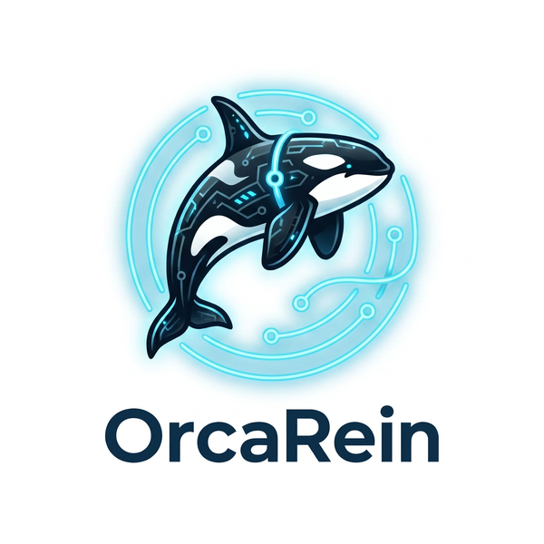

<div align="center">
  <picture>
    <source media="(prefers-color-scheme: dark)" srcset="assets/logo_dark.png">
    
  </picture>

  <p><em>An open-source Rust CLI agent harness for DeepSeek V4 and any OpenAI-compatible LLM.</em></p>

  <p>
    <a href="https://github.com/NickChuCode/orcarein/actions/workflows/ci.yml"></a>
    <a href="#license"></a>
    <a href="https://github.com/NickChuCode/orcarein/releases/latest"></a>
  </p>

  <p><strong>English</strong> · <a href="README.zh-CN.md">简体中文</a></p>
</div>

**OrcaRein** is a small, hackable terminal agent. You chat with a model and it
acts on your project — reading and searching files, editing code, running shell
commands, calling out to external tools — with every risky action gated by a
per-tool permission prompt. It streams responses token-by-token, keeps
multi-turn context, and persists sessions you can resume later.

It ships as a single static binary (DeepSeek by default, or any
OpenAI-compatible endpoint), with an embeddable `orcarein-core` library
underneath. It runs happily behind restricted networks with your own API key,
and degrades honestly: a rich TUI on capable terminals, clean plain output over
pipes, CI, and headless SBCs.

> **Status — v0.3.0.** Usable day-to-day, but pre-1.0: interfaces may still
> change, and there is **no sandbox yet** — the permission prompt is the only
> safety layer (see [Security](#security)). Run it on code under version
> control or backed up. A real sandbox is on the [roadmap](#roadmap).

---

## Capabilities

### Agent core

- **Streaming chat REPL** — token-by-token output, with the model's reasoning
  phase shown separately from its reply.
- **Multi-turn tool-calling loop** with automatic **tool-call repair**
  (malformed calls are recovered instead of crashing the turn) and a
  self-correcting error protocol.
- **Cost & token metering** — live usage accounting per session (`/usage`).

### Built-in tools

Eight tools the model can call, each with a declared risk level:

| Tool | Risk | What it does |
|---|---|---|
| `read_file` | safe | Read a UTF-8 text file |
| `search` | risky | Regex search across the tree, **gitignore-aware**, returns `path:line:text` |
| `list_dir` | risky | List a directory |
| `write_file` | risky | Write / overwrite a file |
| `edit` | risky | Replace a **unique** substring in a file |
| `bash` | risky | Run a shell command (`bash -c` / `cmd /C`), output capped at 32 KiB |
| `skill` | safe | Load a named instruction pack on demand (see [Skills](#skills--subagents)) |
| `task` | safe | Delegate a sub-task to an isolated sub-agent (see [Subagents](#skills--subagents)) |

Plus any **MCP-server tools** registered dynamically from your config.

### Permissions & safety

- **Per-tool permission prompt** — risky tools ask before running
  (`y` / `n` / `A`lways / `N`ever). **Deny-by-default**: empty input, EOF, or
  anything unexpected denies the call.
- Allow / deny decisions are **cached for the session**; answer "always" once
  and that tool runs unprompted for the rest of the run.
- **Permission rule engine** — persist `allow` / `ask` / `deny` rules in
  `config.toml`, matched by tool name plus an optional bash-command or
  file-path glob. `deny` always wins; a built-in set of sensitive-path
  defaults (`.env`, `*.pem`, SSH keys, `~/.aws/credentials`) escalates even a
  safe read to a confirmation, unless you write an explicit `allow` for that
  path.
- **Permission modes** (`--permission-mode` / `/mode`) — a session-wide
  authorization posture layered on top of the rule engine: `default`,
  `acceptEdits`, `plan` (read-only — write tools are hidden from the model,
  not merely refused), and `yolo`. See [Permission modes](#permission-modes)
  below.
- **Hooks** — `PreToolUse` / `PostToolUse` command hooks enforced by exit
  code, not prompt requests, including a recipe for feeding compiler errors
  straight back into context. See [Hooks](#hooks) below.
- **Subagents inherit the parent's posture** — a `task`-delegated sub-agent
  runs under the same permission rules, the same permission mode, and the
  same hooks as its parent (so `plan` mode's read-only guarantee, and any
  `deny` rule, both hold for sub-agent tool calls too).

### Providers & models

- **Pluggable providers** — DeepSeek (default) and OpenAI ship in-box behind one
  `Provider` trait; switch with `--provider` or `ORCAREIN_PROVIDER`. Any
  OpenAI-compatible endpoint works.
- **rustls TLS** — no OpenSSL, so cross-compiling to aarch64 Linux (Raspberry
  Pi / Orange Pi) is painless and the binary carries bundled roots.
- **Transient-failure retry** — 429 / 5xx / network blips are retried with
  exponential backoff before the stream starts; configurable via a `[retry]`
  config section.
- **Runtime model switching** — `/model` switches models live and persists the
  choice; an in-editor picker lists models fetched from the provider's
  `GET /v1/models`, so new models appear and retired ones disappear
  automatically.

### Sessions & context

- **Session persistence** — every turn auto-saves to disk; `session list` /
  `session resume <id>` / `session delete <id>`, and runtime `/sessions`,
  `/resume`, `/new`.
- **Manual context compaction** — `/compact` flattens and summarizes the
  conversation to reclaim the context window (with an honest note about the
  cache cost).
- **Project memory** — a repo's `AGENTS.md` (walked up from the cwd) is folded
  into the system prompt; `/init` scaffolds one.

### Skills & subagents

- **Skills** — named, on-demand instruction packs discovered from
  `.orcarein/skills/*.md` (or `<name>/SKILL.md`). Only a lightweight index sits
  in the prompt; the model pulls a skill's full body via the `skill` tool when
  it's relevant. Browse them with `/skills`.
- **Subagents** — the `task` tool delegates a self-contained sub-task to a fresh
  sub-agent with its **own isolated context window**; only the concise result
  comes back, keeping the main conversation clean.
- **MCP client** — a hand-rolled Model Context Protocol stdio client (default-on
  `mcp` feature) registers external tools from a `[[mcp_servers]]` config block
  at startup.

### Terminal experience

- **Vim modal editor** — a self-built multiline input (normal / insert / visual
  modes, motions, operators, counts, undo/redo, OSC52 clipboard) that degrades
  back to a plain line editor when the terminal can't support it.
- **`@`-mention completion** — an in-editor popup completes project files and
  directories (gitignore-aware); at submit, `@path` injects the file content or
  directory tree so the model sees it without polluting the cached prefix.
- **Markdown pager with syntax highlighting** — `/show` and `/history` render
  headings, bold/italic, fenced code blocks, block quotes, lists, links, and
  CJK-aware tables, with a hand-rolled zero-dependency code highlighter.
- **Semantic color system** — 8 named tokens degrade truecolor → 256 → 16 →
  `NO_COLOR`, with a unified header showing model / cwd / session.
- **Honest degradation** — non-tty, `TERM=dumb`, serial, and headless
  environments fall back to clean plain printing.

### Headless & scripting

- **`run`** — execute a single task non-interactively (prompt as an argument or
  from stdin); the answer goes to stdout, diagnostics to stderr.
- **`--permission-mode <mode>`** to set the session's authorization posture
  (`--no-permission`, non-tty stdin only, still works as a deprecated alias
  for `--permission-mode yolo`), **`--tools`** allowlist, and
  **`--system-prompt-file`** for unattended use.
- **`issue <N>`** — a BYO-key self-bootstrap loop: read a GitHub issue, let the
  agent edit the code (read/list/edit/write, no shell), run `cargo test`, and
  show you the diff. It never commits, pushes, or opens a PR — that's your call.
- **`doctor`** — an offline health check that tells you whether OrcaRein is
  configured correctly before you start.

### Engineering

360+ tests, a three-platform CI matrix (Linux / macOS / Windows) at MSRV
**1.85**, Conventional Commits, `release-plz`-managed changelog, and a
tag-driven pipeline that ships **6 target binaries** per release.

---

## Roadmap

> 🚧 **In development — planned, not yet shipped.** These are targets, not
> commitments; dates and scope may shift. Track progress on the
> [releases](https://github.com/NickChuCode/orcarein/releases) page.

| Capability | What it adds | Target |
|---|---|---|
| **Auto-compact + tool-output pruning** | Threshold-triggered compaction with a reactive `prompt_too_long` fallback; non-destructive pruning of stale tool output; prefix-preserving so the cache survives | v0.5.0 |
| **Sandbox** | New `orcarein-sandbox` crate — Linux Landlock + seccomp (workspace-write + no-network by default), macOS Seatbelt, honest Windows degradation | v0.6.0 |
| **MCP over HTTP** | Streamable HTTP transport, `.mcp.json` project config, deferred tool schemas (idle MCP tools don't bloat the prefix); Playwright-MCP web browsing as the acceptance target | v0.7.0 |
| **Custom slash commands** | `.orcarein/commands/*.md`, reusing the skill discovery/parsing path | v0.7.0 |
| **Parallel subagents** | Fan-out `task` execution + custom agent types (model / tool allowlist / persona via Markdown frontmatter) | v0.7.0 |
| **Repomap** | tree-sitter symbol index for whole-repo code intelligence, offline | v0.7.0 |
| **Checkpoints & rollback** | Side-git snapshots + `/restore` to undo a run's edits | v0.8.0 |
| **Streaming Markdown** | Progressive Markdown rendering during token streaming | v0.8.0 |
| **Web tools** | `web_fetch` + `web_search` behind a `SearchBackend` trait (Bocha for CN, Tavily for intl) — usable behind restricted networks | v0.8.0 |
| **Plan mode / todo tool** | Lightweight planning + task-tracking surface | v0.8.0 |
| **Wider distribution** | crates.io resume, npm / brew wrappers, ecosystem-list inclusion | v0.9.0 |

A **1.0** is gated (not dated) on a frozen, audited `orcarein-core` public API.

---

## Install

### Prebuilt binaries (recommended)

Download the archive for your platform from the
[latest release](https://github.com/NickChuCode/orcarein/releases/latest)
(Linux x86_64 / aarch64, macOS x86_64 / arm64, Windows x86_64), extract it, and
put the `orcarein` binary somewhere on your `PATH`.

### From source

Requires Rust **1.85+** (MSRV):

```sh
git clone https://github.com/NickChuCode/orcarein
cd orcarein
cargo install --path crates/orcarein     # installs the `orcarein` binary
# — or just run it from the workspace:
cargo run --quiet
```

## Quickstart

```sh
# 1. Set your provider's API key (environment only — never a flag/file in the repo).
export DEEPSEEK_API_KEY="sk-..."          # PowerShell: $env:DEEPSEEK_API_KEY = "sk-..."

# 2. Check your setup.
orcarein doctor

# 3. Chat.
orcarein
```

Example session:

```
OrcaRein — chat with deepseek-v4-flash. /help for commands, Ctrl+D to quit.
Provider: deepseek
Tools: bash, edit, list_dir, read_file, search, write_file
> how many workspace members does this repo have?
[思考] I'll read the workspace manifest.
[tool: read_file({"path":"Cargo.toml"})]
[result] 641 bytes
[回复] Four: orcarein-core, orcarein, orcarein-hardware, and orcarein-eval.
```

## Usage

```
orcarein [MODEL] [OPTIONS]          # start the chat REPL
orcarein run [PROMPT]               # run one task non-interactively (headless)
orcarein issue <N>                  # fix GitHub issue #N in the current repo
orcarein doctor                     # offline health check
orcarein config get|set|list        # manage config.toml
orcarein session list|resume|delete  # manage saved sessions
```

| Flag | Meaning |
|---|---|
| `[MODEL]` | Provider-specific model id (overrides config + provider default) |
| `--provider <name>` | `deepseek` (default) or `openai` |
| `--tools <csv>` | Whitelist of tools, e.g. `read_file,search` |
| `--permission-mode <mode>` | Session authorization posture: `default`, `acceptEdits`, `plan`, `yolo` (see [Permission modes](#permission-modes)) |
| `--no-permission` | **Deprecated** — alias for `--permission-mode yolo`. Skip permission prompts, **non-tty stdin only** (a safety guard) |
| `--system-prompt-file <path>` | Read the system prompt from a file |

**Slash commands** (in the REPL): `/help`, `/clear`, `/model`, `/mode`,
`/tools`, `/skills`, `/compact`, `/usage`, `/save`, `/show`, `/history`,
`/init`, `/sessions`, `/resume`, `/new`, `/orca`, `/exit`.

Environment: `DEEPSEEK_API_KEY` / `OPENAI_API_KEY`, `ORCAREIN_PROVIDER`,
`RUST_LOG` (e.g. `RUST_LOG=orcarein=debug` for diagnostics),
`ORCAREIN_CONFIG_DIR` (override the directory holding `config.toml` and
`secrets.toml` — useful for a hermetic/CI run or juggling multiple configs;
a blank value falls back to the platform default).

## Permission modes

A permission mode is a session-wide authorization posture, set once
(`--permission-mode` at startup, or from `[permissions] mode` in
`config.toml`) and switchable at runtime with `/mode <name>` in the REPL. It
decides two things at once: which tools the model is even offered, and which
tool calls run without asking.

| Mode | Tools the model sees | Confirmation behavior |
|---|---|---|
| `default` | All | Safe tools run; risky tools ask (today's behavior, unchanged) |
| `acceptEdits` | All | Same as `default`, but `edit` / `write_file` run silently — `bash` still asks |
| `plan` | Read-only whitelist only (`read_file`, `list_dir`, `search`, `skill`, `task`) | Whitelisted tools run without asking; write tools aren't in the tool list at all, so the model investigates and proposes a plan instead of attempting an edit |
| `yolo` | All | Nothing asks. An explicit `deny` rule still blocks the call — but **there is no rollback net** (checkpoints/rollback are a later milestone) |

Notes:

- `plan` mode's read-only guarantee is enforced twice: the write tools are
  removed from what the model can even call, *and* the permission gate denies
  them outright if the model tries anyway (so a hallucinated tool call still
  fails closed). Sub-agents spawned via `task` inherit the same restriction —
  `plan` mode is not a jailbreak surface.
- Switching modes changes both the tool list and the system prompt in the
  same turn, so that turn is a guaranteed prefix-cache miss. Subsequent turns
  cache normally.
- `--no-permission` keeps its original guard (refused on an interactive
  terminal); `--permission-mode yolo` is allowed interactively but ships off
  by default, prints a warning banner, and stays visible in the status
  line/prompt for as long as it's active.

## Hooks

Hooks are user-configured command guardrails — and also a truth-feedback
channel back into the conversation. `PreToolUse` runs before the permission
gate and can only tighten (block) a call, never loosen one; `PostToolUse`
runs after a successful call and can append extra context to the tool
result. Both are exit-code driven (`0` = proceed, `2` = block for
`PreToolUse`) and configured only in your own `config.toml` — a cloned repo
can never smuggle one in.

A hook doesn't have to be a guardrail. Wired to `PostToolUse`, it can feed the
compiler's own verdict back to the model immediately after an edit, instead
of waiting for the model to think to run `cargo check` itself:

```toml
[[hooks.PostToolUse]]
matcher = "edit|write_file"
command = "cargo check --message-format=short 2>&1 | head -40"
```

After the model edits a file, the next tool result carries the `cargo check`
output — a syntax error surfaces immediately, before the model claims the
edit succeeded.

Hooks apply uniformly across the REPL, `run`, `issue`, and `/init`, and are
**not** limited by the active permission mode — a hook you configured is your
decision, not the model's, so it runs even in `plan` mode.

## Verification gate

`[verify]` is an opt-in convergence check: instead of trusting the model's own
"I'm done" signal, the harness runs a command you configure and only lets the
turn complete once it exits `0`.

```toml
[verify]
command = "cargo test"   # exit 0 = the turn may complete; nonzero = keep fixing
timeout_secs = 300       # optional (default 300)
max_attempts = 3         # optional (default 3): gate firings before hard-stop
```

- **Opt-in.** No `[verify]` table (the default) is today's behavior unchanged —
  the turn ends the moment the model stops calling tools.
- **Fires only after a turn that touched the filesystem.** The gate runs when
  the model has called `write_file`, `edit`, or `bash` at least once and is
  about to finish with no further tool calls; a pure Q&A turn never triggers
  it, no matter what `command` is configured.
- **Runs in the process's current working directory**, via the same shell
  selection the `bash` tool uses (`bash -c` on Unix, `cmd /C` on Windows).
- **A failure is fed back, not silently swallowed.** A nonzero exit appends
  the command's (32 KiB-capped) stdout/stderr as a new message telling the
  model verification failed and to keep fixing, then the turn loops back —
  without consuming one of the tool-call iterations, which is a separate
  cap.
- **Hard-stops** after `max_attempts` consecutive gate failures, or sooner if
  the turn hits the tool-iteration cap first.
- Wired into the REPL, `run`, and `issue`; **not** applied to `/init` or to
  sub-agents spawned via the `task` tool.

## Configuration

Resolved precedence: **CLI flag > environment variable > `config.toml` > built-in default.**

- `config.toml` — non-secret preferences (`provider`, `model`, `tools`,
  `system_prompt`, `[retry]`, `[permissions]` (rules + mode), `[hooks]`,
  `[verify]`, `[[mcp_servers]]`). Manage with `orcarein config set provider openai`.
- `secrets.toml` — API keys, written `0600` on Unix. Keys are also read from the
  environment (env takes precedence). **Never** pass a key as a CLI flag.

Paths are per-platform (XDG on Linux, `%APPDATA%` on Windows); run
`orcarein doctor` to see the exact locations.

## Security

**OrcaRein is not a sandbox** (yet — see the [roadmap](#roadmap)). The permission
prompt is currently the *only* safety layer, and it is deliberately thin:

- `bash`, `write_file`, and `edit` run with **your user's full privileges**. A
  model can delete or overwrite files, or run arbitrary commands, if you allow
  the call.
- The prompt is **deny-by-default**, but once you answer "always" for a tool,
  that tool runs unprompted for the rest of the session.
- `--no-permission` disables the prompt entirely. It is refused on an
  interactive terminal and only works with piped (non-tty) stdin — use it only
  in scripts you trust. `--permission-mode yolo` is the interactive
  equivalent — **it has no rollback net**; there is no checkpoint/undo
  mechanism yet (see the [roadmap](#roadmap)), so a bad edit or a destructive
  shell command is not recoverable through OrcaRein itself.
- Headless `run` and `issue` apply the same rule engine as the interactive
  prompt: reading a sensitive path (`.env`, `*.pem`, SSH keys) is blocked by
  default even though it's a "safe" read, unless you write an explicit
  `allow` rule for it. This is deliberate, not a bug.

Run OrcaRein on code under version control or backed up.

## Development

```sh
cargo test --workspace
cargo clippy --workspace --all-targets -- -D warnings
cargo fmt --check
```

The public contract lives in the tests (`crates/*/tests/` and `#[cfg(test)]`
modules). See [CONTRIBUTING.md](CONTRIBUTING.md).

## License

Dual-licensed under either of [MIT](LICENSE-MIT) or
[Apache-2.0](LICENSE-APACHE) at your option.

## Acknowledgements

Early architecture and tool design were informed by studying
[claw-code](https://github.com/ultraworkers/claw-code).
